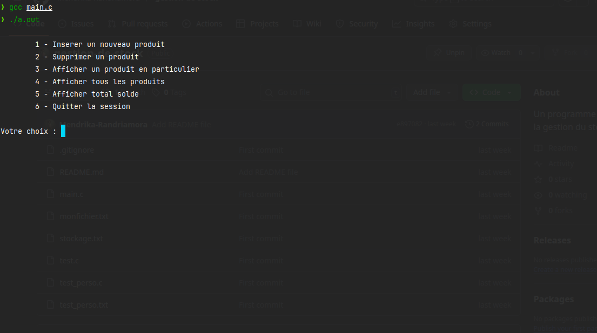
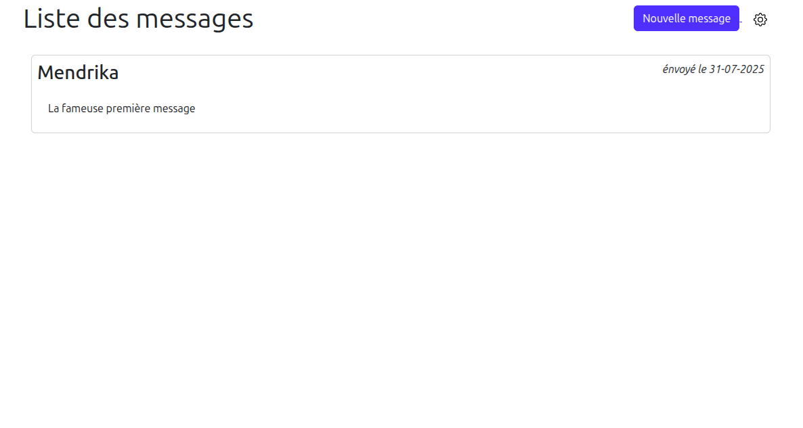

  
  
  <h1>Mendrika Randriamora</h1>
  <strong>Développeur Junior passionné par le web et l'innovation</strong>
   
  <em>"Créer, apprendre, partager : chaque ligne de code est une nouvelle aventure !"</em>
   
  <em>Bienvenue sur mon espace GitHub ! Ici, chaque projet est une occasion de progresser et d'innover.</em>
   
  <em>Je crois que la curiosité et la persévérance sont les clés pour réussir dans le développement.</em>
   
  <em>N'hésitez pas à explorer mes projets et à me contacter pour échanger ou collaborer !</em>

---

  <h2>Compétences</h2>
  

    

      <h3 style="margin-bottom: 10px; color: #e2e2e2;">Front-end</h3>
      

        

          

            
            
          

          HTML &amp; CSS
        

        

          
          JavaScript
        

        

          
          Bootstrap
        

      

    

    

      <h3 style="margin-bottom: 10px; color: #e2e2e2;">Back-end</h3>
      

        

          
           Python
        

        

          
           Flask
        

        

          
           Php
        

        

          
           Laravel
        

      

    

  

---

  <h2>Projets</h2>
  

    <a style="text-decoration: none;" href="https://github.com/Mendrika-Randriamora/gestion-de-stock" target="_blank">
      

        
        <h4 style="margin: 10px 0 4px 0; color: #e2e2e2;">Gestion de stock</h4>
        
Projet en C qui simule une gestion de stock en console.

      

    </a>
    <a style="text-decoration: none;" href="https://github.com/Mendrika-Randriamora/livre-d-or" target="_blank">
      

        
        <h4 style="margin: 10px 0 4px 0; color: #e2e2e2;">PHP from scratch</h4>
        
Projet PHP réalisé sans framework, pour apprendre les bases du langage.

      

    </a>
  

  <a style="padding-top: 20px;" href="https://github.com/Mendrika-Randriamora" target="_blank">
    
     Voir mes repositories GitHub
  </a>

---
<h3 align="center" style="margin-bottom: 18px; color: #e2e2e2;">
  Merci  d'avoir visité mon profil !
</h3>
---

  <h2>Contact</h2>
  

    📧 Email : <a href="mailto:wanimirana@gmail.com">wanimirana@gmail.com</a> 
    💬 WhatsApp : <a href="https://wa.me/261388411483" target="_blank">+261 38 84 114 83</a> 
    🔵 Facebook : <a href="https://facebook.com/mendrika.randriamora" target="_blank">mendrika.randriamora</a>
  

